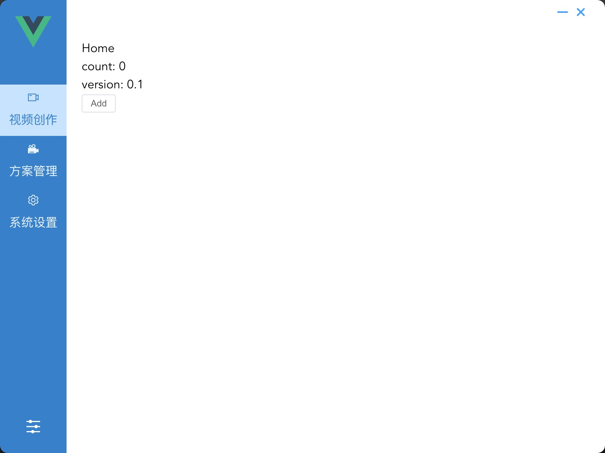

# go-astilectron vue3 demo
Go Asticlectron with vuejs example app


### 依赖
- go 1.17
- go-astilectron v0.29.0
- vue ^3.0.11
- vue-router ^4.1.5
- vuex ^4.0.2
- typescript ^4.2.4

### 测试环境
验证过 mac 和 windows ，均能正常编译出可执行文件， 运行界面功能正常
```shell
$ node --version  
v16.13.1
$ npm --version 
8.1.2
$ go version  
go version go1.17.5 darwin/amd64
```

### 截图


## 步骤

###  install
```
git clone git@github.com:ctwj/go-electron-vue.git
cd go-electron-vue

# 安装 go 语言依赖
go mod tidy

# 安装打包工具
go get -u github.com/asticode/go-astilectron-bundler/...
go install github.com/asticode/go-astilectron-bundler/astilectron-bundler

# 安装 前端依赖
cd frontend
npm install
```

### 编译
```
# 先编译前端部分
cd frontend 
npm run build

# 打包
cd ..
astilectron-bundler
```
打包过程需要下载electron 和 astilectron 的文件， 如果下载不回来， 
直接在 cache_file 文件夹中，找到文件，放置到对应目录即可。

### 开启调试 
程序启动后，按`ctrl+d` 打开electron开发者工具
菜单中也有按钮可以打开

### 查看go语言部分输出
直接在项目根目录运行 `go run *.go`

### 关闭调试
main.go， 修改 debug = false

### 修改窗口属性
```
# WindowOptions
https://pkg.go.dev/github.com/asticode/go-astilectron#WindowOptions
```

### html 发送消息给 go
```
# 参考 frontend/src/pages/index/home.vue

# 发送
Message.send(createMessage('hello'), function(message: MessageData) {
    console.log("received " + message.payload)
});

# go 侧 监听事件
handleMessages 函数会监听到，判断 消息名字即可
if m.Name == "hello" {
		return "world", nil
	}
```

### go 发送消息给  html
```
# 参考 message.go
bootstrap.SendMessage(w, "test", "test data", func(m *bootstrap.MessageIn) {})

# html 侧 监听事件 frontend/src/tils/message.ts
Message.addListener('test', (data) => {
    window.console.log(data);
})
```

### 切换 electron 版本
修改 bundler.json 添加 version_electron 指定

# go-astilectron文档
https://pkg.go.dev/github.com/asticode/go-astilectron#section-readme

